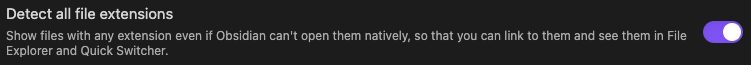

# Livecodes playground

<!-- 

	

 -->

Livecodes playground, an open-source client-side code editor plugin for [Obsidian.md](https://obsidian.md) - powered by [Livecodes.io](https://livecodes.io/docs/overview).

Read about [why Livecodes](https://livecodes.io/docs/why), it's [features](https://livecodes.io/docs/features/) and [how to self-host](https://livecodes.io/docs/features/self-hosting)

> [!IMPORTANT]
> The Livecodes codebase can be self-hosted but is not 100% off-line. Internet connection is required.

## Installation

### Community plugins

1. [Obsidian.md/plugins](https://obsidian.md/plugins?id=livecodes-playground) or
2. Open *Settings* > *Community Plugins* > *Browse*
3. Search for "livecodes"

### via BRAT (Beta Reviewer's Auto-update Tool)

1. Ensure [BRAT](https://github.com/TfTHacker/obsidian42-brat) is installed
2. Trigger the command `Obsidian42 - BRAT: Add a beta plugin for testing`
3. Enter this repository, `gapmiss/livecodes-playground`
4. Enable _Livecodes_ plugin in community plugin list

### Manually

1. download the latest [release archive](https://github.com/gapmiss/livecodes-playground/releases/)
2. uncompress the downloaded archive
3. move the `livecodes-playground` folder to `/path/to/vault/.obsidian/plugins/`
4. Settings > Community plugins > reload **Installed plugins**
5. enable plugin

or:

1. download `main.js`, `manifest.json` & `styles.css`
2. create a new folder `/path/to/vault/.obsidian/plugins/livecodes-playground`
3. move all 3 files to `/path/to/vault/.obsidian/plugins/livecodes-playground`
4. Settings > Community plugins > reload **Installed plugins**
5. enable plugin

## Usage

### Initial setup

1. create a folder inside your vault for storing playground configuration files (`*.JSON`)
	- default: `playgrounds`
2. create a folder inside your vault for storing playground markdown notes (`*.MD`)
	- default: `playgrounds/notes`

### New playground

New playgrounds can be created via:

- `New playground` - (*command*) opens a prompt for the playground name, markup language, style language, CSS processors, and script language.
	

Screenshot

- `Quick playground` - (*command*) and (*ribbon menu*) open a prompt for the playground name. The default markup, style, & script languages can be configured in the settings.
	

Screenshot

- `Open starter playground` (*command*) opens a suggestion prompt with a list of simple starter playgrounds. These starter include `_hyperscript`, `Alpine.js`, `Angular`, `Arrow.JS`, `Astro`, `Bootstrap 5`, `Bulma (CSS)`, `C++`, `HTMX`, `Javascript`, `jQuery`, `Lemonade.JS`, `Lit`, `Lua`, `Lua (wasm)`, `Markdown`, `MDX`, `modulo.js`, `Open-props (CSS)`, `Perl`, `PHP`, `PHP (wasm)`, `Python`, `Python (wasm)`, `React`, `React Native`, `Reef.js`, `Riot.js`, `Ruby`, `SCSS`, `Solid.js`, `Stellar`, `Stencil.js`, `Svelte`, `Tailwind CSS`, `Typescript`, `VanJS`, `Vue 2`, `Vue 3 SFC`

- `New playground from Codepen` (*command*) opens a prompt for a Codepen URL and attempts to import the pen and create a new playground. Please note: this command is experimental and is dependent on Codepen's source code for presenting pens. If Codepen's changes their HTML code, the command could stop working
	

Screenshots

- `Open codeblocks in Livecodes` (*command*) Live-preview and Source mode. The command parses the markdown note for codeblocks and will attempt to create a new playground with 1-3 codeblocks (markup, style, script) based on the codeblock's language. Supported languages include `html`, `mdx`, `css`, `scss`, `javascript`, `js`, `jsx`, `typescript`, `ts`, `tsx`, `astro`, `svelte`.
	

Screenshot

- `Open in Livecodes` - (*codeblock context menu*) via right-click (`ctrl`+`click`) in supported fenced code blocks. Reading mode ONLY. Supported languages include `html`, `mdx`, `css`, `scss`, `javascript`, `js`, `jsx`, `typescript`, `ts`, `tsx`, `astro`, `svelte`.
	

Screenshot

- `Open in Livecodes` - (*file context menu*) via right-click (`ctrl`+`click`) for supported file extensions. Supported extensions include `html`, `mdx`, `css`, `scss`, `js`, `jsx`, `ts`, `tsx`, `astro`, `svelte`.
	

Screenshot

- `Open in Livecodes` - (*folder context menu*) via right-click (`ctrl`+`click`) for supported file extensions. Supported extensions include `html`, `mdx`, `css`, `scss`, `js`, `jsx`, `ts`, `tsx`, `astro`, `svelte`. To activate the menu, the folder must have 1-3 files with the supported extensions. e.g. (`index.html`, `style.css`, `main.js`)
	

Screenshot

- Obsidian `URI` - Create a new playground via importing of a raw JSON configuration file, easily hosted as a Github gist. The Obsidian URL expects 2 parameters, `vault` and `gistUrl` formatted as `obsidian://playground?vault=VAULTNAME&gistUrl=RAW_JSON_URL` The `gistUrl` needs to be URI encoded (see: [Obsidian Help](https://help.obsidian.md/Extending+Obsidian/Obsidian+URI))

	e.g. `obsidian://playground?vault=Playground&gistUrl=https%3A%2F%2Fgist.githubusercontent.com%2Fgapmiss%2Ff558657bcde37c677724004c36ed8dcd%2Fraw%2Ff8a7173bbd17d0886534c2f2017385a5fb3cff48%2FJavascript_starter.json`

### Open playground

Playgrounds can be opened via:

- `Open playground` - (*command*) and (*ribbon menu*) opens a playground fuzzy search prompt.
	

Screenshot

- `Open playground` - (*context menu*) via right-click (`ctrl`+`click`) for playground config files (`*.JSON`).
	

Screenshot

- Obsidian `URI` - Create a new playground via importing of a raw JSON configuration file, easily hosted as a Github gist. The Obsidian URL expects 2 parameters, `vault` and `playgroundPath` formatted as `obsidian://playground?vault=VAULTNAME&playgroundPath=VAULT_PATH_TO_JSON` The `playgroundPath` needs to be URI encoded (see: [Obsidian Help](https://help.obsidian.md/Extending+Obsidian/Obsidian+URI))

	e.g. `obsidian://playground?vault=VAULTNAME&playgroundPath=path/to/playground.json`

> [!IMPORTANT]
> The above context menu options are only available when all file extensions are detected by Obsidian. Open `Settings` &gt; `File and links` and enable `Detect all file extensions` 

<!-- 

<svg xmlns="http://www.w3.org/2000/svg" width="18" height="18" viewBox="0 0 24 24" fill="none" stroke="#7852ee" stroke-width="2" stroke-linecap="round" stroke-linejoin="round" class="lucide lucide-code"><polyline points="16 18 22 12 16 6"/><polyline points="8 6 2 12 8 18"/></svg>

<svg xmlns="http://www.w3.org/2000/svg" width="18" height="18" viewBox="0 0 24 24" fill="none" stroke="#7852ee" stroke-width="2" stroke-linecap="round" stroke-linejoin="round" class="lucide lucide-file-code-2"><path d="M4 22h14a2 2 0 0 0 2-2V7l-5-5H6a2 2 0 0 0-2 2v4"/><path d="M14 2v4a2 2 0 0 0 2 2h4"/><path d="m5 12-3 3 3 3"/><path d="m9 18 3-3-3-3"/></svg>

 -->

## Issues and bug reports

Please submit issues, bug reports, feature requests, etc. to [gapmiss/livecodes-playground/issues](https://github.com/gapmiss/livecodes-playground/issues)

## Development

1. `cd /path/to/vault/.obsidian/plugins`
2. `git clone https://github.com/gapmiss/livecodes-playground.git`
3. `cd livecodes-playground`
4. `npm install`
5. `npm run dev`

## Contributing

Contributions are welcome! Please open an issue for discussion before submitting a pull request with your changes.

## Livecodes

This plugin is powered by the [Livecodes SDK](https://livecodes.io/docs/sdk). The Livecodes SDK is licensed under the [MIT License](https://github.com/live-codes/livecodes/blob/develop/LICENSE).

> MIT License
> 
> Copyright (c) 2021-PRESENT Hatem Hosny
> 
> Permission is hereby granted, free of charge, to any person obtaining a copy
> of this software and associated documentation files (the "Software"), to deal
> in the Software without restriction, including without limitation the rights
> to use, copy, modify, merge, publish, distribute, sublicense, and/or sell
> copies of the Software, and to permit persons to whom the Software is
> furnished to do so, subject to the following conditions:
> 
> The above copyright notice and this permission notice shall be included in all
> copies or substantial portions of the Software.
> 
> THE SOFTWARE IS PROVIDED "AS IS", WITHOUT WARRANTY OF ANY KIND, EXPRESS OR
> IMPLIED, INCLUDING BUT NOT LIMITED TO THE WARRANTIES OF MERCHANTABILITY,
> FITNESS FOR A PARTICULAR PURPOSE AND NONINFRINGEMENT. IN NO EVENT SHALL THE
> AUTHORS OR COPYRIGHT HOLDERS BE LIABLE FOR ANY CLAIM, DAMAGES OR OTHER
> LIABILITY, WHETHER IN AN ACTION OF CONTRACT, TORT OR OTHERWISE, ARISING FROM,
> OUT OF OR IN CONNECTION WITH THE SOFTWARE OR THE USE OR OTHER DEALINGS IN THE
> SOFTWARE.
